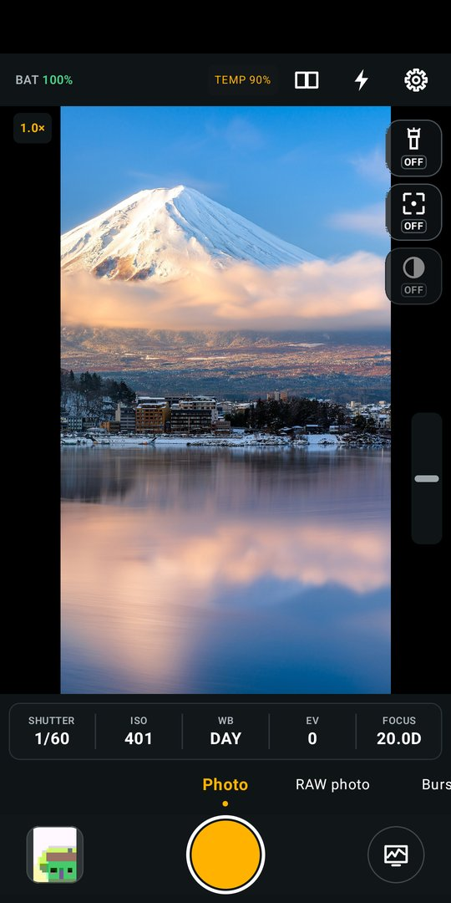
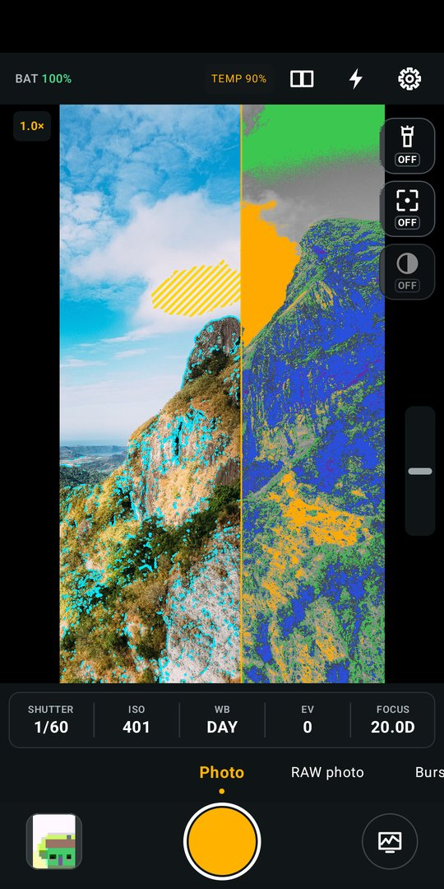
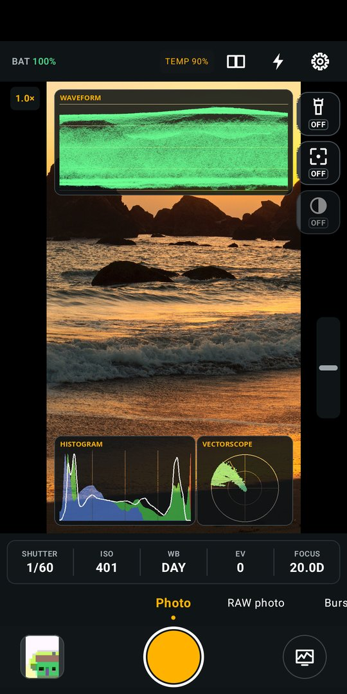
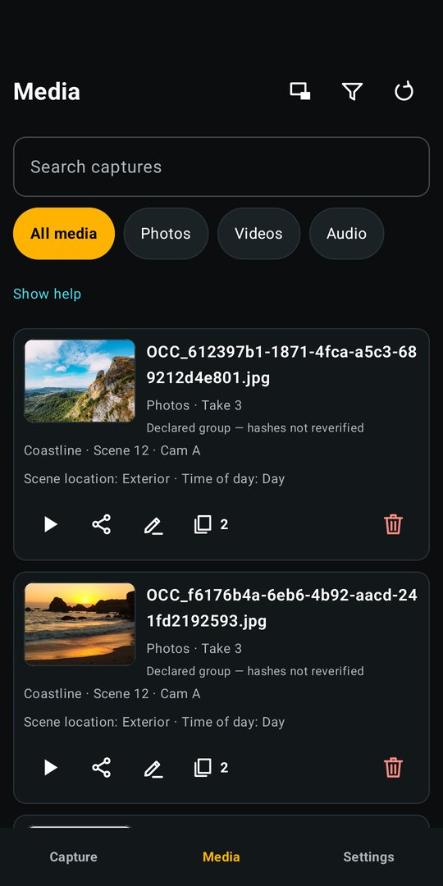
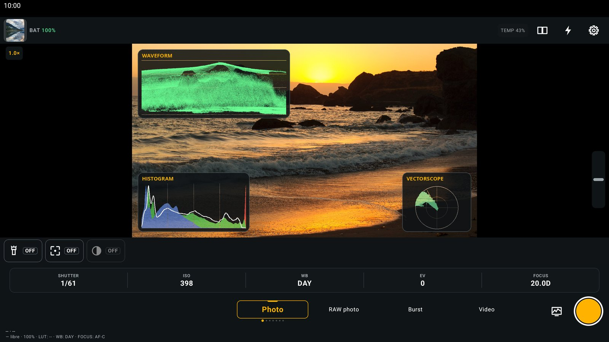

# OpenCineCam

OpenCineCam is a native, open-source cinema camera for Android. It keeps four things apart: what the hardware advertises, what the app requests, what Camera2 reports, and what a recorded file or a controlled test proves. Nothing is presented as supported until the evidence says so.

- **Version:** `0.1.0-beta` (public beta)
- **Package:** `com.librestatic.opencinecam`
- **Requires:** Android 10 (API 29) or later, ARM64
- **License:** [Apache-2.0](LICENSE)
- **Languages:** English, Spanish, French, Portuguese, Italian and German

## Screenshots

| Capture | Zebra, peaking, false color | Scopes | Media |
|---|---|---|---|
|  |  |  |  |



Real app screens captured on an emulator, whose camera feed is a flat frame, so the viewfinder photos (CC0 / public domain, see [`store/play/raw/MEDIA_LICENSES.md`](store/play/raw/MEDIA_LICENSES.md)) and the overlays computed from them were composited in afterwards.

## Features

### Capture

- Photo, burst, bracket, light trail, video, slow motion (real 120/240 fps high-speed takes where the device offers them) and time-lapse.
- Gated experimental modes: RAW photo (DNG), OCLog2 LOG (HEVC Main10), APV and RAW video. They stay hidden unless the device qualifies; APV and RAW video currently take their documented unsupported branch.
- Hardware AVC/HEVC video (software AVC only for time-lapse), HLG10/Main10 where qualified.
- Audio as an AAC MP4 track or as separate lossless WAV/FLAC sidecars, with live level meters.
- Shared VIDEO/LOG pause, SMPTE timecode (JSON sidecar) and production slate metadata.

### Monitoring and operation

- Full-screen viewfinder with translucent, compact chrome and side rails for short landscape windows; works in both orientations, on phones, tablets and foldables (including exterior-display subject preview).
- Focus peaking, zebra, false color, histogram, waveform and vectorscope (with quick toggles in the capture row), grid and horizon level.
- Operator, subject and recording LUTs, LOG view assist, and an always-on thermal load indicator.
- Assignable operator buttons, persistent settings and portable presets.
- First-run wizard with permission rationale; **Cine** and **Material You** themes.

### Media

- On-device catalog with playback, rename, share and delete.
- Durable queue for on-device editing proxies.
- Optional, off by default: WebDAV transfers of finalized takes (explicit per-bundle action, HTTPS only, Wi-Fi unless cellular is allowed) and photo/take geotagging.

## Principles

- Public Android APIs and Camera2 only in the portable capture path.
- No accounts, ads, analytics, telemetry, crash reporting, cloud dependency or automatic upload. Network access exists only for the opt-in WebDAV transfers.
- No silent downgrade of camera, codec, frame rate, RAW, HLG, bit depth or audio state.
- Unknown hardware behavior stays *Unknown*, never false or verified.
- An active recording survives UI recreation through a properly declared foreground service.

See [security and privacy](docs/security-and-privacy.md) for details.

## Permissions

| Permission | Used for |
|---|---|
| `CAMERA` | Capture and preview. |
| `RECORD_AUDIO` | Optional audio tracks, sidecars and meters; video still records without it. |
| `POST_NOTIFICATIONS`, `FOREGROUND_SERVICE`, `FOREGROUND_SERVICE_CAMERA`, `FOREGROUND_SERVICE_MICROPHONE` | The visible foreground service that keeps a take alive across UI recreation. |
| `INTERNET`, `ACCESS_NETWORK_STATE` | Opt-in WebDAV transfers only (PLAN-067 / ADR-0034). Off by default; presets never enable networking; nothing is uploaded without an explicit action. |
| `ACCESS_COARSE_LOCATION`, `ACCESS_FINE_LOCATION` | Opt-in geotagging only, requested at runtime while the camera screen is open. Off by default. |

No broad storage permission is requested: MediaStore and the Storage Access Framework own destinations.

## Project status

Most of the implementation plans are done: the capability/evidence model, Strict/Adaptive policy, Camera2 graph negotiation and lifecycle recovery, encoder selection, muxing and finalization, audio negotiation, the native AHardwareBuffer/OpenGL ES pipeline, thermal hardening, HLG/Main10 qualification, RAW still and RAW10 contracts, crash-safe RAW journaling, desktop recovery tooling, and signed releases.

Still open:

- **OCLog2** is reachable from the launcher and has passed a physical GLES numeric check and cadence-gated 32-second 1080p30 Main10 takes with no dropped frames on the reference device, but stays *experimental* until ISP-derived, OCIO/DCTL/LUT, clipping/range and independent-editor evidence is in ([PLAN-061](docs/plans/PLAN-061-oclog2-specification-interchange-and-device-qualification.md)).
  - Experimental [Lightforge Studio](docs/color/lightforge/README.md) downloads turn OCLog2 into a stock-camera Rec.709 look: [regular takes (HLG)](https://github.com/LibreStatic/opencinecam/raw/main/docs/color/lightforge/OCLog2_HLG_to_Stock709.cube) and [120/240 fps takes (HFR)](https://github.com/LibreStatic/opencinecam/raw/main/docs/color/lightforge/OCLog2_HFR-SDR_to_Stock709.cube). Set Lightforge's input profile to *Standard Rec.709* before applying them.
- **RAW video** stays disabled after failing the 60-second RAW10 throughput gate.
- **F-Droid and Google Play** activation is tracked in [PLAN-062](docs/plans/PLAN-062-f-droid-and-google-play-channel-activation.md).

## Repository layout

| Path | Contents |
|---|---|
| `app/` | Compose UI, capture service, settings, presets, media catalog. |
| `camera/` | Camera2 identity, graph negotiation, lifecycle and high-speed sessions. |
| `media/` | Encoders, muxer, audio and file finalization. |
| `core/model/` | Pure-JVM capability/evidence model and schemas. |
| `native-pipeline/` | NDK AHardwareBuffer and OpenGL ES processing. |
| `desktop-tools/` | Dependency-free desktop RAW recovery tooling. |
| `tools/` | Qualification, release, SBOM and validation scripts. |
| `docs/` | Requirements, ADRs, architecture, plans, formats and release docs. |
| `store/play/` | Google Play listings, declarations and store image scripts. |

Documentation hierarchy: accepted requirements → accepted ADRs → architecture and schemas → implementation plans → code and evidence. Start with the [technical closure](docs/technical-closure.md), the [architecture](docs/architecture.md) and the [plan index](docs/plans/README.md).

## Building and testing

Use JDK 17 and the checked-in Gradle wrapper:

```bash
JAVA_HOME=/usr/lib/jvm/java-17-openjdk ./gradlew --no-daemon --dependency-verification=strict lint test assembleDebug
```

Instrumented tests (local only, need a device or emulator):

```bash
JAVA_HOME=/usr/lib/jvm/java-17-openjdk ./gradlew --no-daemon --dependency-verification=strict connectedDebugAndroidTest
```

Formatting, Python tooling and the plan graph:

```bash
./tools/check_format.sh
python3 -m unittest discover -s tools/tests -p 'test_*.py'
python3 tools/validate_plan_system.py
```

Add `--require-evidence` to the plan validator for release certification (`evidence/` is not part of a clean checkout). `python3 tools/device_gate.py --output evidence/plan-034/device-gate.json` records non-promotional device identity evidence for conditional gates.

## Releases

The same source ships through three channels ([release contract](docs/release/three-channel-release.md)):

- **GitHub:** every push to `main` builds a prerelease tagged `v<versionName>+<versionCode>` with an ARM64 APK and a Play App Bundle; tags build signed ARM64 APKs with checksums.
- **Google Play:** the bundle is signed with a separate upload key (`tools/build-play-bundle.sh`); uploading it to Play stays manual.
- **F-Droid:** reproducible build from the tagged source and lockfiles.

`versionCode` comes from the CI run number plus an offset, so it always increases. Signing keys never enter the repository.

## Contributing

Issues and pull requests are welcome at [LibreStatic/opencinecam](https://github.com/LibreStatic/opencinecam). Run the checks above before opening a pull request, and keep device claims backed by evidence.
